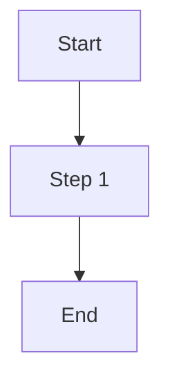

# How-To Guides Content

This directory contains markdown guides that are built into the How-To Guides tool.

## File structure

- `guides/` — Guide markdown file pairs (one `.md` for Korean, one `_en.md` for English)
- `_TEMPLATE.md` / `_TEMPLATE_en.md` — Templates for new guides
- `README.md` — This file

## Creating a guide

1. Copy `_TEMPLATE.md` and `_TEMPLATE_en.md` to `guides/` with your guide slug:
   ```
   guides/my-guide.md
   guides/my-guide_en.md
   ```

2. Edit the Korean file (`guides/my-guide.md`):
   - Set `title`, `summary`, `topic`, `tags`, `order`, etc. in frontmatter (YAML)
   - Structural metadata (slug, topic, tags, order, updated, difficulty, coverImage, related) should ONLY be in the Korean file
   - Write the markdown body with prose, code blocks, images, and diagrams

3. Edit the English file (`guides/my-guide_en.md`):
   - Set `title` and `summary` in frontmatter (Korean file's structural metadata is inherited)
   - Write the English markdown body
   - Do NOT duplicate structural metadata — it will be inherited from the Korean file

## Frontmatter fields (Korean file only, mandatory)

```yaml
---
title: 가이드 제목
slug: guide-slug
summary: |
  한두 문장 요약. 카드에 표시됩니다.
topic: setup  # setup, ai-tools, git, api, cli, deploy
tags: [tag1, tag2]
order: 1
updated: 2026-07-06  # ISO date YYYY-MM-DD
difficulty: beginner  # beginner, intermediate, advanced
coverImage: /images/howto/guide-slug/cover.png  # optional
related: [other-guide-slug]  # optional list of related guide slugs
---
```

## Markdown features

### Code blocks with syntax highlighting

```bash
npm install -g @anthropic-ai/claude-code
```

Supported languages: bash, shell, ts, tsx, js, json, python, yaml, diff, http, sql, plaintext

### Mermaid diagrams



### Images with captions

```markdown

```

Images must live under `public/images/howto/<slug>/` and be referenced with absolute paths.

## Build process

When you run `npm run dev` or `npm run build`:

1. The generator scans all markdown pairs
2. Validates required fields (title, summary, body in both locales)
3. Applies the canonical rule (structural metadata from Korean file)
4. Emits `src/components/tools/howto/data/guides.generated.json`

If validation fails, the build stops with a clear error message.

## Publishing a guide

After creating your guide files:

```bash
pnpm prebuild
```

The guide appears immediately:
- Hub grid card: `/[locale]/tools/howto`
- Spoke page: `/[locale]/tools/howto/guide-slug`
- Search results
- Sitemap

No code changes needed!
