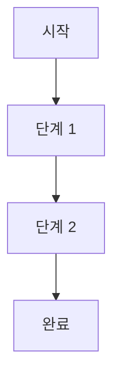

## Section 1

첫 번째 섹션 본문입니다.

```bash
npm install -g @anthropic-ai/claude-code
```

## Section 2: 다이어그램 예시


```mermaid
flowchart TD
  A[시작] --> B[단계 1]
  B --> C[단계 2]
  C --> D[완료]
```

## Section 3: 이미지 포함


