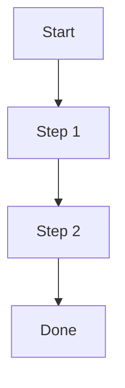

## Section 1

First section body in English.

```bash
npm install -g @anthropic-ai/claude-code
```

## Section 2: Diagram Example


```mermaid
flowchart TD
  A[Start] --> B[Step 1]
  B --> C[Step 2]
  C --> D[Done]
```

## Section 3: Image Example


