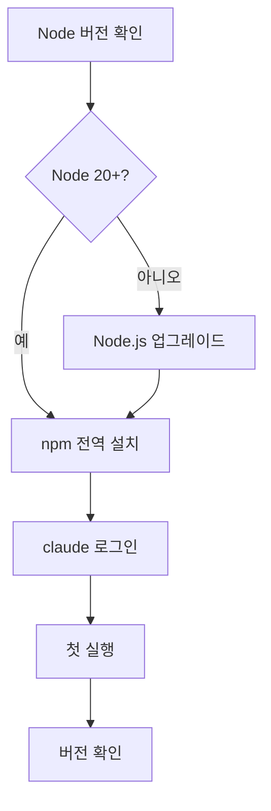

## 준비물

- Node.js 20 이상
- 터미널 (zsh / bash / PowerShell)

## 설치 흐름



## 설치 명령

### macOS / Linux

```bash
npm install -g @anthropic-ai/claude-code
claude --version
```

### Windows (PowerShell)

```powershell
npm install -g @anthropic-ai/claude-code
claude --version
```

## 설치 확인

설치가 끝나면 다음 명령으로 버전을 확인할 수 있습니다:

```bash
claude --version
```

출력이 다음과 같으면 설치 완료입니다:

```
claude-code/1.0.0
```

## 첫 실행

```bash
claude
```

로그인 프롬프트가 표시됩니다. API 키를 입력하고 진행하세요.
