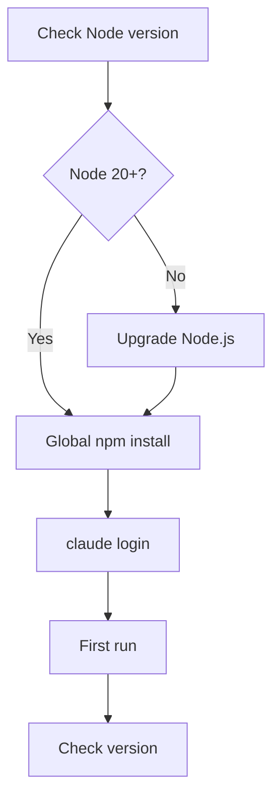

## Prerequisites

- Node.js 20 or later
- Terminal (zsh / bash / PowerShell)

## Install flow



## Install command

### macOS / Linux

```bash
npm install -g @anthropic-ai/claude-code
claude --version
```

### Windows (PowerShell)

```powershell
npm install -g @anthropic-ai/claude-code
claude --version
```

## Verify installation

After installation, verify with:

```bash
claude --version
```

Output should be:

```
claude-code/1.0.0
```

## First run

```bash
claude
```

A login prompt appears. Enter your API key to proceed.
